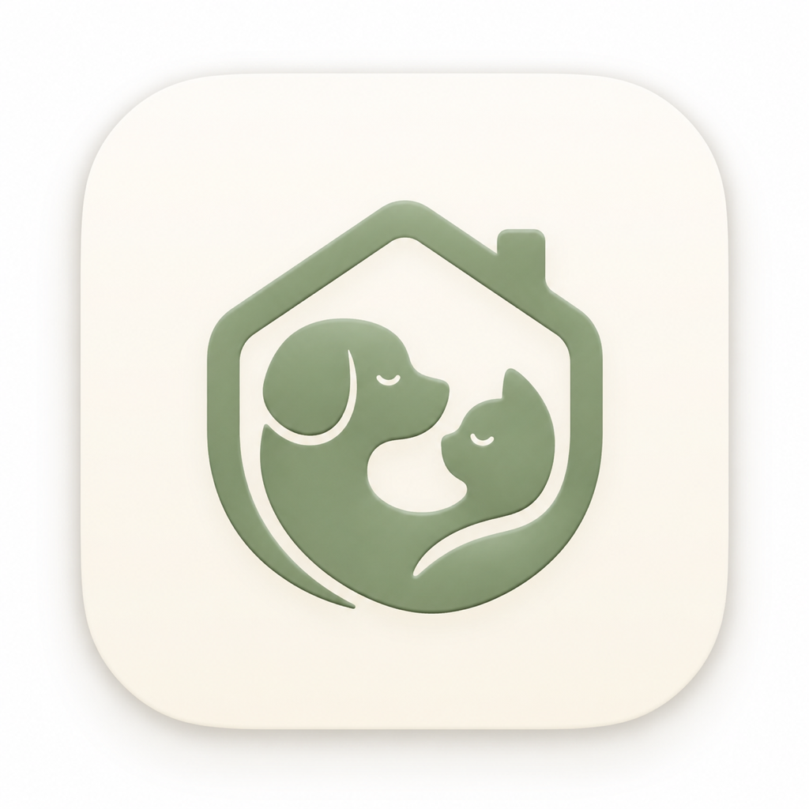

# 🐾 Fluffy Carebook

  
   
  <h3>Track your pet's care together with your family! / Evcil dostunuzun bakımını ailece tek bir yerden takip edin!</h3>

## 🇹🇷 Türkçe (Turkish)

**Fluffy Carebook**, evcil dostlarınızın (kedi, köpek, kuş, tavşan ve diğerleri) bakımını ailenizle ortaklaşa yönetebileceğiniz akıllı bir bakım günlüğü ve harcama takip uygulamasıdır. Sevimli dostunuzun aşı günlerinden ilaç saatlerine, veteriner randevularından aylık mama masraflarına kadar her şeyi tek bir uygulamadan kolayca takip edin.

### Öne Çıkan Özellikler
- **👥 Ortak Bakım Ekibi:** Eşinizi, ailenizi veya bakıcınızı davet edin. Evcil hayvanınızın bakım rutinlerini birlikte takip edin, kimin neyi tamamladığını anında görün.
- **🔔 Akıllı Hatırlatıcılar:** Aşılar, iç/dış parazit uygulamaları, ilaç saatleri ve veteriner kontrolleri için bildirimler alın. Dostunuzun sağlık takvimini asla aksatmayın.
- **💰 Harcama Takibi:** Mama, veteriner, ilaç ve aksesuar masraflarını kategorize edin. Aylık harcamalarınızı grafiklerle analiz ederek bütçenizi kontrol altında tutun.
- **📈 Gelişim Takibi:** Dostunuzun kilo ve boy gelişimini düzenli olarak kaydedin, grafiklerle büyüme sürecini izleyin.

---

## 🇬🇧 English

**Fluffy Carebook** is a smart pet care journal and expense tracker that helps you manage the care of your furry friends (cats, dogs, birds, rabbits, and more) together with your family. Easily track everything from vaccine schedules and medication times to vet appointments and monthly food expenses from a single app.

### Key Features
- **👥 Shared Care Team:** Invite your spouse, family members, or caregivers. Track pet care routines together and instantly see who completed which task.
- **🔔 Smart Reminders:** Get notifications for vaccines, deworming, medication times, and vet check-ups. Never miss an event in your pet's health calendar.
- **💰 Detailed Expense Tracker:** Categorize expenses like food, vet, medicine, and accessories. Analyze monthly spending with graphs to keep your budget under control.
- **📈 Growth Tracking:** Log your pet’s weight and height periodically, and monitor their physical development over time with interactive charts.

---
© 2026 Emircan Mert. All rights reserved.
